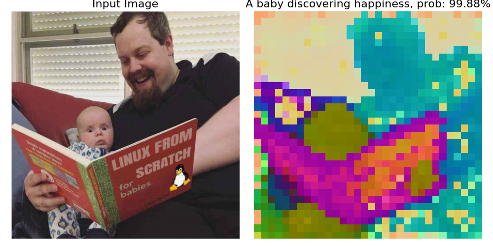

# Equimo: Modern Multimodal Models in JAX/Equinox

**WARNING**: This is a research library implementing recent model architectures. The implementations are based on paper descriptions and may not be exact replicas of the original implementations. Use with caution in production environments.

Equimo provides JAX/Equinox implementations of recent architectures across modalities. Vision is the most complete modality today; language has first-class text encoders/tokenizers, and audio has package boundaries ready for future implementations.

## Features

- Pure JAX/Equinox implementations
- Focus on recent architectures (2023-2026 papers)
- **Registry system** — register custom attention, FFN, norm, and model classes by name
- **`BlockChunk`** — universal building block for staged architectures; supports string-based layer resolution, positional embeddings, downsampling, and stochastic depth
- String-based layer resolution everywhere — pass `"layernorm"` instead of `eqx.nn.LayerNorm`
- Modular design for easy experimentation
- Extensive documentation and type hints
- Modality-specific namespaces: `equimo.vision`, `equimo.language`, `equimo.audio`
- Generic serialization utilities in `equimo.serialization`

## Installation

### From PyPI

```bash
pip install equimo
```

### From Source

```bash
git clone https://github.com/clementpoiret/equimo.git
cd equimo
pip install -e .
```

## Package Layout

Equimo is organized by modality, with reusable building blocks separated from
modality-specific code:

| Namespace | Purpose |
| --------- | ------- |
| `equimo.core` | Shared layers, scan ops, implicit/DEQ utilities, EMA helpers |
| `equimo.vision` | Vision models, vision layers, and image IO |
| `equimo.language` | Text encoders and tokenizers |
| `equimo.audio` | Audio extension namespace; model/layer/IO scaffolding only for now |
| `equimo.serialization` | Checkpoint save/load, weight loading, archive download/decompression |
| `equimo.registry` | Modality-aware model registry |

This is a breaking layout change. The old top-level `equimo.models`,
`equimo.layers`, `equimo.io`, `equimo.implicit`, and `equimo.experimental`
entrypoints are intentionally removed.

### Migration Cheat Sheet

| Old import | New import |
| ---------- | ---------- |
| `import equimo.models as em` | `import equimo.vision.models as em` |
| `from equimo.layers import ...` | `from equimo.vision.layers import ...` for vision layers, or `from equimo.core.layers import ...` for shared layers |
| `from equimo.io import load_model, save_model, load_weights` | `from equimo.serialization import load_model, save_model, load_weights` |
| `from equimo.io import load_image` | `from equimo.vision.io import load_image` |
| `from equimo.experimental.text import Tokenizer` | `from equimo.language import SentencePieceTokenizer` |
| `load_model("experimental.textencoder", ...)` | `load_model("text_transformer_encoder", ..., modality="language")` |

## Implemented Vision Models

Beyond a standard ViT (e.g., DINOv2 or SigLIP), Equimo provides other SotA architectures:

| Model         | Paper                                                                                                                                                           | Year | Status    |
| ------------- | --------------------------------------------------------------------------------------------------------------------------------------------------------------- | ---- | --------- |
| FasterViT     | [FasterViT: Fast Vision Transformers with Hierarchical Attention](https://arxiv.org/abs/2306.06189)                                                             | 2023 | ✅        |
| Castling-ViT  | [Castling-ViT: Compressing Self-Attention via Switching Towards Linear-Angular Attention During Vision Transformer Inference](https://arxiv.org/abs/2211.10526) | 2023 | Partial\* |
| MLLA          | [Mamba-like Linear Attention](https://arxiv.org/abs/2405.16605)                                                                                                 | 2024 | ✅        |
| PartialFormer | [Efficient Vision Transformers with Partial Attention](https://eccv.ecva.net/virtual/2024/poster/1877)                                                          | 2024 | ✅        |
| SHViT         | [SHViT: Single-Head Vision Transformer with Memory Efficient Macro Design](https://arxiv.org/abs/2401.16456)                                                    | 2024 | ✅        |
| VSSD          | [VSSD: Vision Mamba with Non-Causal State Space Duality](https://arxiv.org/abs/2407.18559)                                                                      | 2024 | ✅        |
| ReduceFormer  | [ReduceFormer: Attention with Tensor Reduction by Summation](https://arxiv.org/abs/2406.07488)                                                                  | 2024 | ✅        |
| LowFormer     | [LowFormer: Hardware Efficient Design for Convolutional Transformer Backbones](https://arxiv.org/abs/2409.03460)                                                | 2024 | ✅        |
| DINOv3        | [DINOv3](https://arxiv.org/abs/2508.10104)                                                                                                                      | 2025 | ✅†       |
| FreeNet       | [FreeNet: Liberating Depth-Wise Separable Operations for Building Faster Mobile Vision Architectures](https://ojs.aaai.org/index.php/AAAI/article/view/33041)   | 2025 | ✅‡       |
| EUPE          | [Efficient Universal Perception Encoder](https://arxiv.org/abs/2603.22387)                                                                                      | 2026 | ✅        |
| ViT-5         | [ViT-5: Vision Transformers for The Mid-2020s](https://arxiv.org/abs/2602.08071)                                                                                | 2026 | ✅        |

\*: Only contains the Linear Angular Attention module. It is straightforward to build a ViT around it, but may require an additional `__call__` kwarg to control the `sparse_reg` bool.

†: DINOv3 is a `VisionTransformer` configuration using RoPE positional embeddings and SwiGLU FFN. Pretrained weights are available — see [pretrained models](#list-of-pretrained-models).

‡: FreeNet building blocks (`FreeNetBlock`, `S2Mixer`, `ShiftNeck`) are implemented in `equimo.vision.layers` and registered in the convolution registry. There is no standalone `FreeNet` model class; use `BlockChunk` to compose a full network from these blocks.

## Vision Usage

```python
import jax
import equimo.vision.models as em

key = jax.random.PRNGKey(0)
model = em.VisionTransformer(
    img_size=224,
    in_channels=3,
    dim=384,
    patch_size=14,
    num_heads=[6],
    depths=[12],
    num_classes=1000,
    key=key,
)

x = jax.random.normal(key, (3, 224, 224))

# Inference (dropout disabled)
logits = model(x, key=key, inference=True)

# Feature extraction
features = model.features(x, key=key, inference=True)
```

## Predefined Model Variants

Every model family ships convenience constructors that encode the canonical
hyperparameters for each published variant. Under the hood each constructor
resolves through a two-level registry: a shared **base config** (e.g.
`in_channels=3`) and a **variant config** (depths, widths, …) that are merged
before the model is instantiated. Any key can be overridden at call time via
`**kwargs`.

```python
import jax
import equimo.vision.models as em

key = jax.random.PRNGKey(0)

# Build a predefined variant with default config
model = em.vit_base_patch16_224(key=key)

# Override specific parameters — e.g. fine-tune head size or disable the class token
model = em.vit_small_patch16_224(num_classes=10, key=key)

# Models with pretrained weights accept a `pretrained` flag
model = em.dinov2_vitb14(pretrained=True)
```

### Available variants

| Family              | Constructors                                                                                                                                                   |
| ------------------- | -------------------------------------------------------------------------------------------------------------------------------------------------------------- |
| `VisionTransformer` | `vit_tiny/small/base/large/huge_patch{16,32}_224`, `vit_huge_patch14_224`, `dinov2_vit{s,b,l,g}14{_reg}`, `dinov3_vit*`, `siglip2_vit*`, `tips_vit*`, `vit5_*` |
| `ConvNeXt`          | `convnext_*`, `eupe_convnext_tiny/small/base`                                                                                                                  |
| `AttNet`            | `attnet_{xxs,xs,s,t1,t2,t3,t4}`                                                                                                                                |
| `IFormer`           | `iformer_{t,s,m,m_faster,l,l_faster}`                                                                                                                          |
| `LowFormer`         | `lowformer_backbone_{b0,b1,b2,b3}`                                                                                                                             |
| `ReduceFormer`      | `reduceformer_backbone_{b1,b2,b3}`                                                                                                                             |
| `MobileNetv3`       | `mobilenetv3_{small,large}`                                                                                                                                    |

> `LowFormer` requires `attention_type` (`"softmax"` or `"sigmoid"`) which has
> no sensible default and must be supplied by the caller.

### Extending the variant registry

Each family exposes its internal registry dict and `_build_*` function. You can
add your own variants without subclassing:

```python
from equimo.vision.models.attnet import _ATTNET_REGISTRY, _ATTNET_BASE_CFG, _build_attnet

_ATTNET_REGISTRY["attnet_custom"] = (
    _ATTNET_BASE_CFG,
    {"depths": [3, 3, 9, 3], "dims": [56, 112, 224, 448], "drop_path_rate": 0.15},
)

model = _build_attnet("attnet_custom", key=jax.random.PRNGKey(0))
```

## Registry System

Equimo exposes registries for layer families and full model classes. Each layer
registry follows the same pattern:
a `register_*` decorator and a `get_*` resolver. All model and layer constructors
accept string names wherever a class would normally be passed.

### Available registries

| Registry function      | Layer family           | Exported from   |
| ---------------------- | ---------------------- | --------------- |
| `register_attn`        | Attention modules      | `equimo.core.layers`, `equimo.vision.layers` |
| `register_attn_block`  | Transformer blocks     | `equimo.core.layers`, `equimo.vision.layers` |
| `register_ffn`         | Feed-forward networks  | `equimo.core.layers` |
| `register_norm`        | Normalisation layers   | `equimo.core.layers` |
| `register_act`         | Activation functions   | `equimo.core.layers` |
| `register_conv`        | Convolution blocks     | `equimo.vision.layers.convolution` |
| `register_patch`       | Patch embedding layers | `equimo.vision.layers` |
| `register_posemb`      | Positional embeddings  | `equimo.vision.layers` |
| `register_downsampler` | Downsampling layers    | `equimo.vision.layers` |
| `register_dropout`     | Dropout variants       | `equimo.core.layers` |
| `register_mixer`       | SSM / mixer blocks     | `equimo.core.layers` |
| `register_se`          | Squeeze-and-excitation | `equimo.vision.layers` |
| `register_wavelet`     | Wavelet transforms     | `equimo.vision.layers` |
| `register_model`       | Full model classes     | `equimo.registry` or modality model packages |

`equimo.vision.layers.get_layer` resolves a string name across core and vision layer
registries in priority order, so `BlockChunk` and vision model constructors can accept
a single string for any layer type. `equimo.core.layers.get_layer` is available for
shared/core-only code.

Model registration is modality-aware:

```python
from equimo.registry import get_model_cls, register_model

@register_model("mynet", modality="vision")
class MyVisionModel(eqx.Module):
    ...

assert get_model_cls("mynet", modality="vision") is MyVisionModel
```

If a name exists in more than one modality, pass `modality=` to disambiguate.

### Example: register a custom attention and build a ViT with it

```python
import jax
import jax.numpy as jnp
import jax.random as jr
import equinox as eqx
from jaxtyping import Array, Float, PRNGKeyArray

import equimo.vision.models as em
from equimo.vision.layers import register_attn, register_attn_block

# ── 1. Define and register the attention module ───────────────────────────────

@register_attn("myattn")
class MyAttention(eqx.Module):
    """Minimal scaled dot-product attention (single-head demo)."""

    qkv: eqx.nn.Linear
    proj: eqx.nn.Linear
    dim: int = eqx.field(static=True)

    def __init__(self, dim: int, *, key: PRNGKeyArray, **kwargs):
        self.dim = dim
        k1, k2 = jr.split(key)
        self.qkv = eqx.nn.Linear(dim, 3 * dim, use_bias=False, key=k1)
        self.proj = eqx.nn.Linear(dim, dim, use_bias=False, key=k2)

    def __call__(
        self,
        x: Float[Array, "seq dim"],
        *,
        key: PRNGKeyArray,
        inference: bool = False,
    ) -> Float[Array, "seq dim"]:
        seq, d = x.shape
        qkv = jax.vmap(self.qkv)(x)              # (seq, 3*dim)
        q, k, v = jnp.split(qkv, 3, axis=-1)     # each (seq, dim)
        scale = d ** -0.5
        attn = jax.nn.softmax(
            (q @ k.T * scale).astype(jnp.float32), axis=-1
        ).astype(x.dtype)
        return jax.vmap(self.proj)(attn @ v)


# ── 2. Wrap it in a transformer block and register it ────────────────────────

@register_attn_block("myattnblock")
class MyAttentionBlock(eqx.Module):
    norm1: eqx.nn.LayerNorm
    norm2: eqx.nn.LayerNorm
    attn: MyAttention
    mlp: eqx.nn.MLP

    def __init__(
        self,
        dim: int,
        num_heads: int,   # accepted for API compatibility; ignored here
        mlp_ratio: float = 4.0,
        drop_path: float = 0.0,
        *,
        key: PRNGKeyArray,
        **kwargs,
    ):
        k1, k2 = jr.split(key)
        self.norm1 = eqx.nn.LayerNorm(dim)
        self.norm2 = eqx.nn.LayerNorm(dim)
        self.attn = MyAttention(dim=dim, key=k1)
        self.mlp = eqx.nn.MLP(
            in_size=dim,
            out_size=dim,
            width_size=int(dim * mlp_ratio),
            depth=1,
            key=k2,
        )

    def __call__(
        self,
        x: Float[Array, "seq dim"],
        *,
        key: PRNGKeyArray,
        inference: bool = False,
        **kwargs,
    ) -> Float[Array, "seq dim"]:
        x = x + self.attn(
            jax.vmap(self.norm1)(x), key=key, inference=inference
        )
        x = x + jax.vmap(self.mlp)(jax.vmap(self.norm2)(x))
        return x


# ── 3. Plug it into VisionTransformer via its string name ────────────────────

key = jr.PRNGKey(0)
model = em.VisionTransformer(
    img_size=224,
    in_channels=3,
    dim=384,
    patch_size=16,
    num_heads=[6],
    depths=[6],
    num_classes=1000,
    block="myattnblock",   # ← resolved from the registry
    key=key,
)

x = jax.random.normal(key, (3, 224, 224))
logits = model(x, key=key, inference=True)
print(logits.shape)  # (1000,)
```

Re-registering an existing name raises a `ValueError` by default. Pass `force=True` to
override:

```python
@register_attn("myattn", force=True)
class MyImprovedAttention(eqx.Module):
    ...
```

## BlockChunk

`BlockChunk` (from `equimo.vision.layers` or `equimo.core.layers`) is the canonical building block for multi-stage
vision architectures. It groups a sequence of identical blocks with optional positional
embedding and downsampling, and handles stochastic depth scheduling automatically.

```python
from equimo.vision.layers import BlockChunk
from equimo.vision.layers.attention import AttentionBlock
from equimo.vision.layers.downsample import ConvNormDownsampler
import jax.random as jr

key = jr.PRNGKey(0)

stage = BlockChunk(
    depth=4,
    in_channels=96,
    out_channels=192,
    module="attentionblock",       # resolved from _ATTN_BLOCK_REGISTRY
    module_kwargs={"dim": 96, "num_heads": 3, "mlp_ratio": 4.0},
    downsampler="convnormdownsampler",  # resolved from _DOWNSAMPLER_REGISTRY
    downsampler_kwargs={},         # in_channels/out_channels injected automatically
    downsample_last=True,          # blocks run first, then downsample
    drop_path=0.1,
    key=key,
)
```

Passing a list of drop-path rates of length `depth` applies them per block. Any
list-valued entry in `module_kwargs` whose length equals `depth` is also spread across
blocks (e.g. per-block attention types).

## Language Usage

`equimo.language` provides text encoders and tokenizers. Text tokenization relies on
`tensorflow_text`; install Equimo with the `language` extra:

```bash
pip install equimo[language]
```

Zero-shot classification example using TIPS:

```python
import jax
from einops import rearrange

from equimo.language import SentencePieceTokenizer
from equimo.serialization import load_model
from equimo.vision.io import load_image
from equimo.utils import PCAVisualizer, normalize, plot_image_and_feature_map

key = jax.random.PRNGKey(42)
image = load_image("./demo.jpg", size=448)
text = [
    "A baby discovering happiness",
    "A computer",
]

image_encoder = load_model("vit", "tips_vits14_hr", modality="vision")
text_encoder = load_model(
    "text_transformer_encoder",
    "tips_vits14_hr_text",
    modality="language",
)

ids, paddings = SentencePieceTokenizer(identifier="sentencepiece_tips").encode(
    text, max_length=64
)

text_embedding = normalize(
    jax.vmap(text_encoder, in_axes=(0, 0, None))(ids, paddings, key)
)
image_embedding = jax.vmap(image_encoder.norm)(image_encoder.features(image, key))
cls_token = normalize(image_embedding[0])
spatial_features = rearrange(
    image_embedding[2:], "(h w) d -> h w d", h=int(448 / 14), w=int(448 / 14)
)

cos_sim = jax.nn.softmax(
    ((cls_token[None, :] @ text_embedding.T) / text_encoder.temperature), axis=-1
)

label_idxs = jax.numpy.argmax(cos_sim, axis=-1)
cos_sim_max = jax.numpy.max(cos_sim, axis=-1)
label_predicted = text[label_idxs[0]]
similarity = cos_sim_max[0]
pca_obj = PCAVisualizer(spatial_features)
image_pca = pca_obj(spatial_features)

plot_image_and_feature_map(
    image.transpose(1, 2, 0),
    image_pca,
    "./out.png",
    "Input Image",
    f"{label_predicted}, prob: {similarity * 100:.2f}%",
)
```

Resulting in such a wonderful result:



## Saving and Loading Models

Equimo provides utilities for saving models locally and loading pre-trained models from the
[official repository](https://huggingface.co/poiretclement/equimo).

### Saving Models Locally

```python
from pathlib import Path
from equimo.serialization import save_model

# Save model with compression (creates .tar.lz4 file)
save_model(
    Path("path/to/save/model"),
    model,
    model_config,
    torch_hub_cfg,  # can be an empty list; used to track weight provenance
    compression=True,
)

# Save model without compression (creates directory)
save_model(
    Path("path/to/save/model"),
    model,
    model_config,
    torch_hub_cfg,
    compression=False,
)
```

### Loading Models

```python
from equimo.serialization import load_model

# Load a pre-trained vision model from the official repository
model = load_model(cls="vit", identifier="dinov2_vits14_reg", modality="vision")

# Load a local model (compressed)
model = load_model(cls="vit", path=Path("path/to/model.tar.lz4"), modality="vision")

# Load a local model (uncompressed directory)
model = load_model(cls="vit", path=Path("path/to/model/"), modality="vision")
```

Constructor parameters can be overridden at load time:

```python
model = load_model(
    cls="vit",
    identifier="siglip2_vitb16_256",
    modality="vision",
    dynamic_img_size=True,  # forwarded to VisionTransformer.__init__
)
```

Custom models registered with `register_model` can also be loaded by name:

```python
from equimo.vision.models import register_model

@register_model("mynet", modality="vision")
class MyNet(eqx.Module):
    ...

model = load_model("mynet", path=Path("mynet.tar.lz4"), modality="vision")
```

## List of Pretrained Models

The following models have pretrained weights available in Equimo:

- [DINOv2](https://arxiv.org/abs/2304.07193)
- [DINOv3](https://arxiv.org/abs/2508.10104)
- [SigLIP2](https://arxiv.org/abs/2502.14786)
- [TIPS](https://arxiv.org/abs/2410.16512)
- [EUPE](https://arxiv.org/abs/2603.22387) (both ViT and ConvNeXt variants)

Model identifiers map to filenames in Equimo's [HuggingFace repository](https://huggingface.co/poiretclement/equimo/tree/main/models/default).

Examples:

- `dinov2_vitb14`
- `dinov2_vits14_reg`
- `dinov3_vits16_pretrain_lvd1689m`
- `dinov3_vitb16_pretrain_lvd1689m`
- `dinov3_vitl16_pretrain_lvd1689m`
- `dinov3_vits16plus_pretrain_lvd1689m`
- `dinov3_vith16plus_pretrain_lvd1689m`
- `dinov3_vit7b16_pretrain_lvd1689m`
- `dinov3_vitl16_pretrain_sat493m`
- `dinov3_vit7b16_pretrain_sat493m`
- `siglip2_vitl16_512`
- `siglip2_vitso400m16_384`
- `tips_vitg14_lr`

## Audio

`equimo.audio` currently provides package boundaries for future audio support:
`equimo.audio.models`, `equimo.audio.layers`, and `equimo.audio.io`. No audio loaders
or audio model implementations are shipped yet.

## Mixed Precision

Equimo follows a strict WYSIWYG policy — modules never silently cast inputs or weights.
Cast your model before running inference:

```python
import jax
import jax.numpy as jnp
import equinox as eqx

model_bf16 = jax.tree_util.tree_map(
    lambda leaf: leaf.astype(jnp.bfloat16) if eqx.is_inexact_array(leaf) else leaf,
    model_fp32,
)
```

Isolated `float32` upcasts are mandatory for numerically sensitive operations
(softmax, layer norm variance). These are applied internally where needed.

## Contributing

Contributions are welcome! Please feel free to submit a Pull Request. For major changes, please open an issue first to discuss what you would like to change.

## License

This project is licensed under the MIT License - see the LICENSE file for details.

## Citation

If you use Equimo in your research, please cite:

```bibtex
@software{equimo2024,
  author = {Clément POIRET},
  title = {Equimo: Modern Multimodal Models in JAX/Equinox},
  year = {2024},
  publisher = {GitHub},
  url = {https://github.com/clementpoiret/equimo}
}
```
